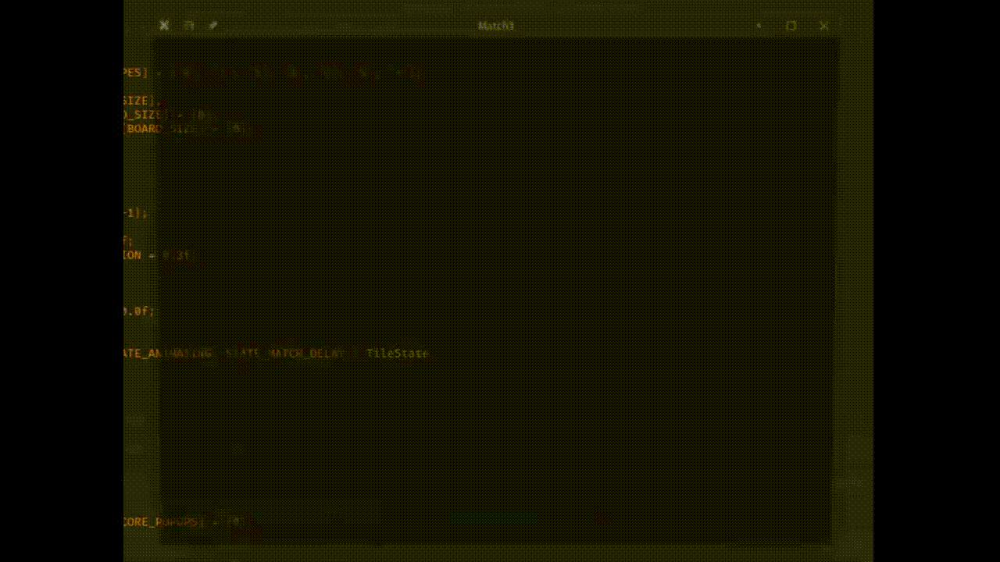

# match3

A simple 2D match-3 game written in C and raylib



## Dependencies

Make sure you have installed:

- gcc
- make or cmake
- raylib

## Build and run project

- **With Make:**

```bash
make && ./build/match3
```

- **With CMake:**

```bash
mkdir build
cd build
cmake ..
cmake --build .
./match3
```

## Credits

- Based on [C Programming with Raylib – Match3 Game Tutorial, by FreeCodeCamp](https://youtu.be/P7PMA3X1tf8?si=VhdXCoPHqO98TcAP)
- Background image: [wallhaven](https://wallhaven.cc/w/28yqpg)
- Background music: [OpenGameArt](https://opengameart.org/content/calm-ambient-2-synthwave-15k)
- Match sound effect: [tutorial assets](https://github.com/erikyuzwa/raylib-2d-ascii-match-3/blob/main/assets/match_old.mp3)
- Font: [oldschool PC fonts](https://int10h.org/oldschool-pc-fonts/)
